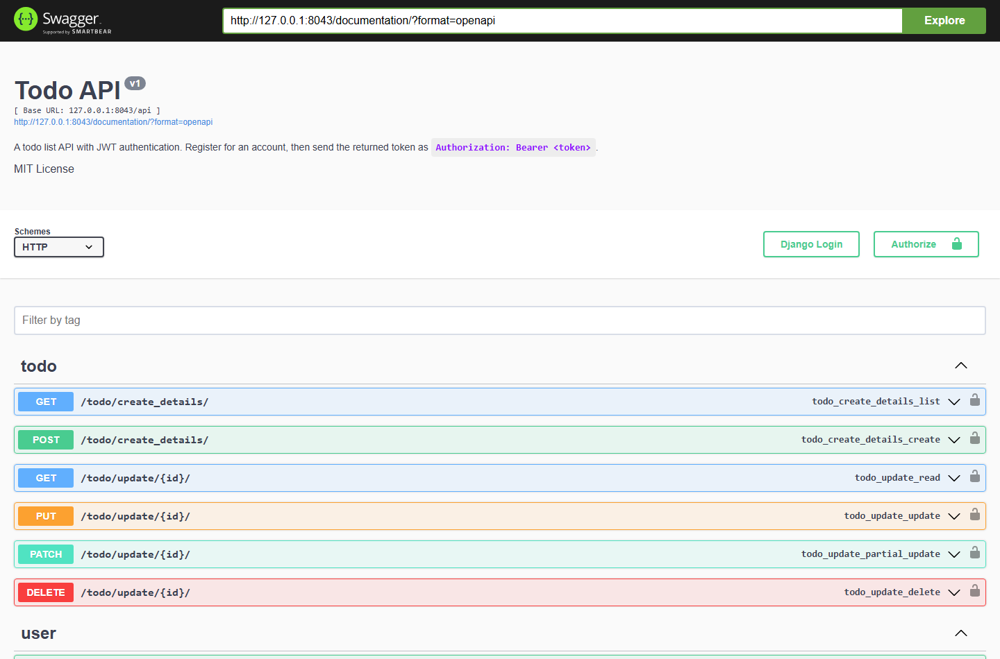
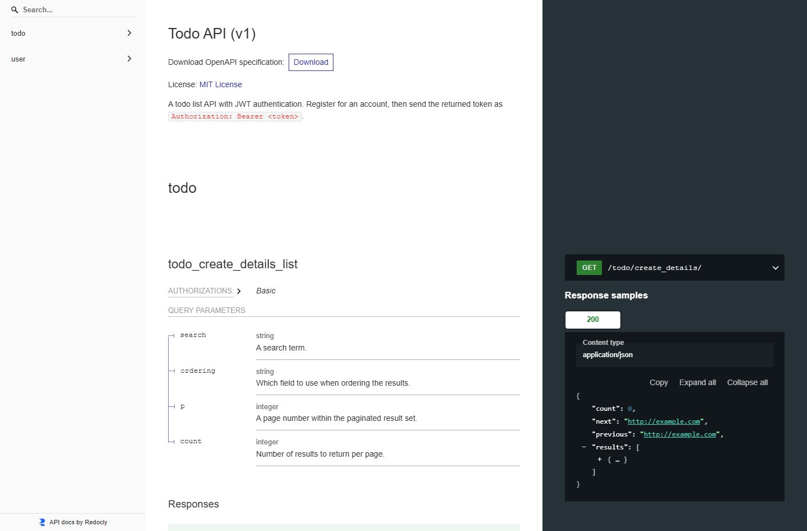

# Todo API

A todo list REST API built with Django and Django REST Framework, using a custom
user model that authenticates by email and issues JSON Web Tokens. Todos are
scoped to their owner, so each account only ever sees its own.

Interactive API documentation is generated by drf-yasg and served at
`/documentation/`.

---

## Screenshots

| Swagger UI (`/documentation/`) | Redoc (`/redoc/`) |
|---|---|
|  |  |

---

## Endpoints

| Method | Path | Auth | Purpose |
|---|---|---|---|
| `POST` | `/api/user/register/` | — | Create an account |
| `POST` | `/api/user/login/` | — | Exchange email and password for a token |
| `GET` | `/api/user/user/` | Bearer | The authenticated user |
| `GET`/`POST` | `/api/todo/create_details/` | Bearer | List or create todos |
| `GET`/`PUT`/`PATCH`/`DELETE` | `/api/todo/update/{id}/` | Bearer | Read or modify one todo |
| — | `/documentation/` | — | Swagger UI |
| — | `/redoc/` | — | Redoc |
| — | `/documentation.json/` | — | Raw OpenAPI schema |
| — | `/admin/` | — | Django admin |

Log in with **email**, not username: the user model sets
`USERNAME_FIELD = "email"`. The `username` field exists and must be unique, but
it is not what you authenticate with.

Send the token as `Authorization: Bearer <token>`. Tokens are signed with
`SECRET_KEY` (HS256) and expire after 24 hours.

### Todo fields

| Field | Type | Notes |
|---|---|---|
| `title` | string | |
| `desc` | string | Required. Note the name — not `description` |
| `is_complete` | boolean | Defaults to `false` |
| `owner` | user | Set from the token; not accepted from the request |

List responses are paginated.

---

## Running it

Requires Python 3.10+.

```bash
python -m venv .venv
source .venv/bin/activate          # Windows: .venv\Scripts\activate
pip install -r requirements.txt

cp .env.example .env               # then set DJANGO_SECRET_KEY
python manage.py migrate
python manage.py runserver
```

Then open http://127.0.0.1:8000/documentation/.

### A quick check that it works

```bash
curl -X POST http://127.0.0.1:8000/api/user/register/ \
  -H "Content-Type: application/json" \
  -d '{"username":"ada","email":"ada@example.com","password":"a-strong-password"}'

curl -X POST http://127.0.0.1:8000/api/user/login/ \
  -H "Content-Type: application/json" \
  -d '{"email":"ada@example.com","password":"a-strong-password"}'
# -> {"email": "...", "username": "...", "token": "..."}

curl -X POST http://127.0.0.1:8000/api/todo/create_details/ \
  -H "Authorization: Bearer <token>" \
  -H "Content-Type: application/json" \
  -d '{"title":"Write the README","desc":"describe the endpoints"}'
```

---

## Tests

```bash
python manage.py test
```

12 tests, covering the user and todo models.

---

## Configuration

| Variable | Default | Notes |
|---|---|---|
| `DJANGO_SECRET_KEY` | an insecure development value | Also signs the JWTs — set a generated key for anything real |
| `DJANGO_DEBUG` | `False` | Set `True` for local development only |
| `DJANGO_ALLOWED_HOSTS` | `localhost,127.0.0.1` | Comma-separated |

Generate a key with:

```bash
python -c "from django.core.management.utils import get_random_secret_key; print(get_random_secret_key())"
```

---

## Layout

```
core/      settings, root URLs, WSGI/ASGI
users/     custom user model, JWT helper, register and login views
tools/     Todo model, serializers, views, pagination
helpers/   shared model mixins (created_at / updated_at tracking)
test/      model tests
```

---

## Scope

A learning project. Tokens are issued but not refreshable or revocable — a
leaked token stays valid for its full 24 hours. There is no password reset, and
SQLite is the only configured database.

---

## License

MIT — see [LICENSE](LICENSE).
